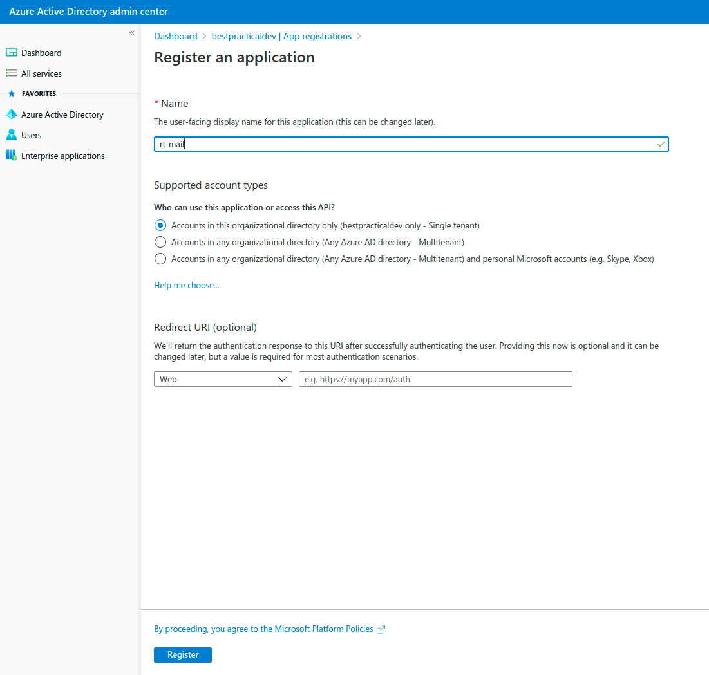
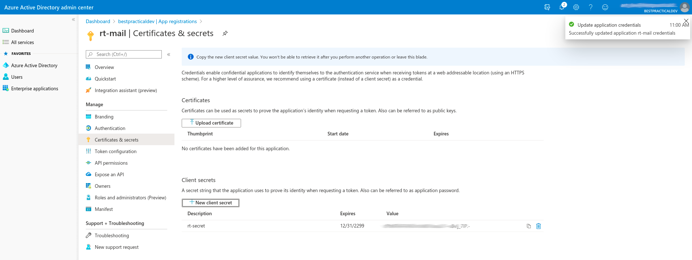
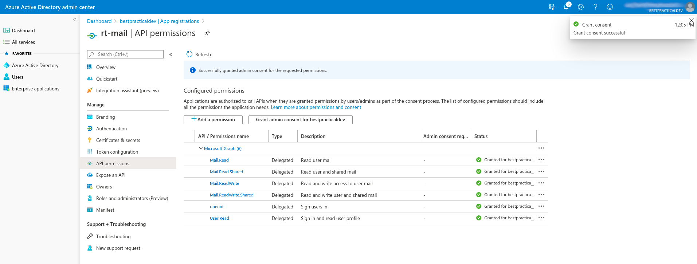
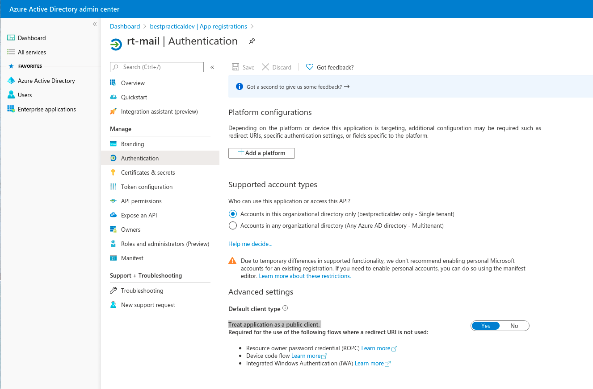
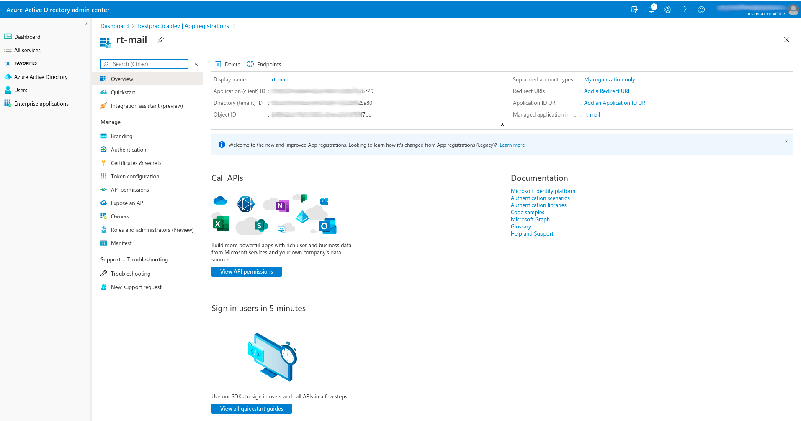

# Setting up mail API integration in microsoft365

## Active Directory application configuration

From Azure Active directory admin center..
1. Go to App Registrations and then "New registration", select single tenant and register.

2. Go to certificates and secrets, add a new client secret. 

3. Go to API permissions and add the following delegated rights :
  * Microsoft Graph :
        * Mail.Read Delegated right
        * Mail.Read.Shared Delegated right
        * Mail.ReadWrite Delegated right
        * Mail.ReadWrite.Shared Delegated right
        * openid  Delegated right
        * User.Read  Delegated right

4. Once the rights have been added, grant admin consent to allow the API client to use them.
5. Then go to authentication, and change "Treat application as a public client." to "yes".


## Further microsoft 365 documentation

* https://docs.microsoft.com/en-gb/azure/active-directory/develop/quickstart-register-app


## wsgetmail tool configuration

Configuration of the wsgetmail tool needs the following fields specific to the ms365 application:
* Application (client) ID - client_id in the configuration file, a UUID string, i.e. abcd1234-xxxx-xxxx-xxxx-123abcde1234
* Directory (tenant) ID - tenant_ud in the configuration file, a UUID string, i.e.  abcd1234-xxxx-xxxx-xxxx-1234abcdef99

You can get these details from the overview of the registered application


For access to the email account you need:
* Account email address - username in configuration file
* Account password - user_password in configuration file
* Folder (defaults to Inbox, currently only one folder is supported) - folder in configuration file

## Example configuration

``` Javascript
{
  "handler_options":{
     "url":"http://rt.example.tld/",
     "debug":"1",
     "class":"Mailgate",
     "command_path":"/path/to/rt/bin",
     "recipient":"rt@example.tld",
     "action_on_fetched":"mark_as_read"
   },
   "username":"rt@example.tld",
   "user_password":"password",
   "tenant_id":"abcd1234-xxxx-xxxx-xxxx-123abcde1234",
   "client_id":"abcd1234-xxxx-xxxx-xxxx-1234abcdef99",
   "action_on_fetched":"mark_as_read",
   "folder":"Inbox"
}
```

